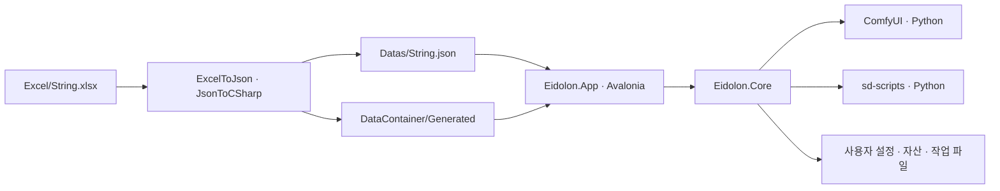

# Eidolon 아키텍처

기준일: 2026-10-05. 현재 구현의 책임 경계와 실행 흐름을 기록한다. 작업 시 지켜야 할 사항은 [작업 규칙](WorkingRules.md), 다국어 생성 절차는 [문자열 데이터 변환](StringData.md)이 소유한다.

## 제품 방향

Eidolon은 Avalonia 기반 Windows 데스크톱 이미지 생성·LoRA 학습 프로그램이다. 실행 환경과 모델을 준비한 뒤 사용자는 자연어 프롬프트를 입력하고 결과를 확인한다. 기본 생성 지침·제외할 요소는 설정에서 관리한다. 생성 파라미터와 ComfyUI 워크플로는 프로그램 내부에서 구성한다.

ComfyUI는 이미지 생성 백엔드로 사용한다. ComfyUI의 노드 편집기를 대체하거나 노드 그래프를 화면에 노출하지 않는다. 설치, 모델·LoRA 관리, 생성, 학습, 이어 학습과 학습 결과 등록을 하나의 앱에서 제공한다.

기본 모델은 SDXL Base 1.0, 기본 생성 크기는 1024×1024다. SD 1.5는 가져온 모델의 호환 계열로 지원한다. Bough의 Core/App 분리, Dignus DI, 템플릿 로딩, Excel 다국어와 라이트 테마 구성을 참고한다. 재사용 문서 중 [CodingConvention](ReusableArchitecture/CodingConvention.md)과 [ReleasePolicy](ReusableArchitecture/ReleasePolicy.md)를 적용하며 Unity·Actor·Tick·RepoDB 구조는 채택하지 않는다.

## 솔루션과 의존성

| 위치 | 책임 | 주요 타입 |
|---|---|---|
| `Eidolon.Core/Domain` | 실행 설정, 모델·작업·프리셋, 오류와 진행 계약 | `StudioSettings`, `ModelAsset`, `JobRecord`, `StudioException`, `WorkProgress` |
| `Eidolon.Core/Application` | 생성·학습 유스케이스, FIFO 큐, seed 공급 계약 | `StudioService`, `StudioWorkQueue`, `ISeedProvider` |
| `Eidolon.Core/Infrastructure` | 설치, ComfyUI 연결·실행, 학습 실행, 배경 제거, 파일과 자산 저장 | `RuntimeInstaller`, `ComfyEngine`, `ProcessRunner`, `LoraTrainer`, `BackgroundRemovalService`, `AssetLibrary`, `JobStore` |
| `Eidolon.App` | Avalonia 진입점·화면, DI 조립, 템플릿 로딩, 앱 수명 | `Program`, `App`, `MainWindow`, `TemplateDataLoader` |
| `Eidolon.App/ViewModels` | 사용자 입력, 바인딩, 화면 상태와 결과 연결 | `StudioViewModel`, 화면용 항목·선택 모델 |
| `Eidolon.App/Presenters` | 큐 진입, UI 스레드 복귀, 진행·취소와 예약 작업 수명 | `StudioWorkPresenter`, `StudioWorkState` |
| `Eidolon.App/Services`, `Localization` | 대화상자, 사용자 설정, 언어·테마, 파일 로그와 메시지 번역 | `SettingsStore`, `DesktopSettings`, `StringHelper`, `StudioMessageTemplates` |
| `DataContainer/Generated` | Excel에서 생성한 템플릿·컨테이너·로더 | `StringTemplate`, `TemplateContainer`, `TemplateLoader` |
| `Excel`, `Datas`, `ExportTools` | 문자열 원본, 생성 JSON, 변환 도구와 설정 | `String.xlsx`, `String.json` |

Core는 .NET, Dignus.Collections·Dignus.Log와 배경 제거용 ONNX Runtime·SkiaSharp를 사용하며 App, Avalonia, DataContainer, 언어·테마·번역 서비스와 UI 리소스 키를 참조하지 않는다. App은 Core와 DataContainer를 참조하고 Avalonia 및 Dignus DI를 사용한다. DataContainer는 생성 데이터 계약을 제공한다.

`StudioException`은 `StudioMessageCode`와 인자를, `WorkProgress`는 코드·인자·진행률·불확정 진행 여부를 전달한다. App의 `StudioMessageTemplates`가 코드와 Excel 키의 대응을 소유하고 `StringHelper`가 표시 문장을 만든다. Core에 `IStringProvider`를 두지 않는다. 언어·테마를 포함한 전체 사용자 설정은 App의 `DesktopSettings`와 `SettingsStore`가 소유하며 Core에는 실행용 `StudioSettings`를 전달한다.

## 시작, DI와 종료

1. `Program`이 사용자별 Mutex로 앱 중복 실행을 제한하고 `DesktopLogging`과 전역 오류 로그를 구성한다.
2. Avalonia 시작 전에 `TemplateDataLoader.Load`가 생성 `TemplateLoader.Load`와 `MakeRefTemplate`을 실행한다.
3. `App`이 Dignus `ServiceContainer`에서 저장소, HTTP 클라이언트, 시간·seed 공급자, 엔진, 유스케이스, 큐, Presenter와 ViewModel을 조립한다. 주요 런타임 서비스와 큐는 앱 공용 인스턴스다.
4. DI로 생성한 `MainWindow`에 ViewModel과 문자열 서비스를 주입한다. 창이 열리면 설정·이력을 읽고 엔진 준비 작업을 예약한다.
5. 설정된 주소의 기존 ComfyUI에 먼저 연결한다. 기존 서버가 없으면 조건에 맞는 로컬 설치 엔진을 실행한다. 설치가 필요한 경우 엔진 탭으로 안내한다.
6. 창을 닫을 때 새 요청을 막고 예약·대기 요청과 현재 작업을 취소한 뒤 큐 종료를 기다린다. 이어 앱 소유 엔진을 정리하고 HTTP 클라이언트와 로그를 종료한다.

View는 DI 컨테이너, HTTP 클라이언트나 별도 작업 큐를 생성하지 않는다. `StudioWorkPresenter`는 비동기 실행과 UI 알림의 수명을 담당한다. 기능별 서비스 호출 뒤 화면 목록·결과를 갱신하는 연결은 ViewModel에 남아 있다.

## 화면 구성

상단 브랜드와 같은 줄에 이미지 생성, 이미지 편집, 생성 결과, 학습, 엔진, 설정, 사용법 탭을 배치한다. 사용법의 학습 안내는 기존 `ShowTrainingCommand`로 학습 탭에 바로 연결한다. 엔진 안에는 엔진 설치와 모델·LoRA 하위 탭을 두고 `SelectedEngineTab`이 선택 상태를 소유한다. 엔진 설치 하위 탭은 실행 환경 설치·복구, 서버 연결과 설치 모듈 조회를 담당한다. 모델 설치·삭제 목록은 모델·LoRA 하위 탭의 `ModelsView` 안에 `ModelDownloadsView`로 한 번만 배치한다. 모델 파일 가져오기와 계열·트리거 관리도 이 화면에서 기존 자산 서비스를 사용한다. 모델마다 왼쪽에 이름·계열·용량·설명을, 오른쪽에 설치 버튼 또는 사용 가능 상태·삭제 버튼을 표시한다. 체크박스와 별도 목록 선택 상태는 만들지 않는다. `ModelDownloadItem.InstallCommand`·`DeleteCommand`는 기존 Presenter 유지 관리 큐를 사용하며 설치 진행 상태만 항목에 표시한다. 로컬 엔진 준비 전에는 설치 안내를 제공하고 외부 서버 자산에서는 모델 설치·삭제를 비활성화한다. 생성 화면에서는 사용할 모델·LoRA를 선택한다.

엔진 설치 하위 탭의 `EngineView`는 스크롤 위에 작은 엔진·모델 상태 줄을 표시한다. `NeedsModelSetup`이 참일 때만 모델 준비 안내와 다음 동작 버튼을 별도로 강조하고 완료 상태를 큰 배너로 반복하지 않는다. `EngineSetupCaption`은 설치·연결 상태, `ModelSetupCaption`·`ModelSetupHint`·`ModelSetupActionCaption`은 준비 상태 확인·모델 미설치·설치 중인 모델명·사용 가능한 모델 수와 다음 동작을 표시한다. 상태는 기존 엔진 연결·자산 목록·`ModelDownloadItem.IsInstalling`에서 읽으며 별도 준비 상태를 저장하지 않는다. 설치·연결 버튼은 내용에 맞는 크기로 배치하고 기술 안내와 설치 모듈 목록은 펼쳐 조회한다. `PrepareModelsCommand`는 준비 상태에 따라 엔진 준비 또는 모델·LoRA 하위 탭으로 이동하고 설치 중에도 사용할 수 있다. 엔진 설치를 완료했는데 모델이 없으면 해당 탭으로 이어지고 설치·가져오기를 안내한다. 외부 서버에서는 서버 모델 준비와 목록 새로고침을 안내한다. 생성 화면의 빈 모델 선택 영역에도 같은 안내와 이동 버튼을 제공하고 선택 모델이 없으면 생성 요청 버튼을 비활성화한다. 입력 영역의 유지 관리 잠금과 모델 관리 이동을 분리한다.

모델 설치 목록의 스크롤은 `ModelsView`에서 높이를 제한하고 세로 스크롤바를 항상 표시한다. 자동 숨김을 끄고 너비 18의 전용 공간과 콘텐츠 우측 여백 12를 확보해 설치·삭제 버튼과 겹치지 않게 한다. 목록에만 적용하는 스타일로 손잡이를 둥글게 표시하고 기본 상태에는 테마의 `MutedBrush`, 마우스 이동·드래그 상태에는 `AccentBrush`를 사용한다. 모델 목록은 설치 중에도 스크롤·조회할 수 있고 변경 동작은 기존 명령의 유지 관리 조건으로 제한한다.

학습 화면은 `TrainingView`가 소유하며 기존 `StudioViewModel`·Presenter·학습 큐를 사용한다. 이미지·이름·설명 입력과 모델·단계 수·트리거·이어 학습 설정을 나란히 배치하고 요청 버튼은 스크롤 밖에 고정한다. 학습 기록 목록과 화면 선택 상태는 만들지 않으며 작업 기록·로그·산출물은 `JobStore`가 보존한다. 현재 학습 상태는 하단에서 확인하고 완료 LoRA는 생성 화면에서 선택한다. 생성 화면의 LoRA 선택 목록에는 저장된 자동 적용 트리거를 표시한다.

`ModelsView`의 파일 가져오기·새로고침은 목록 상단에 둔다. 설치 목록과 내 모델·LoRA 목록이 가용 높이를 나누어 사용하며 `HasSelectedAsset`이 참일 때만 선택 정보 영역의 폭을 확보한다. 모델 계열 수정은 상세 설정에 두고 호출 단어 입력은 `IsSelectedAssetLora`가 참일 때만 표시한다. 자동 판별되지 않은 계열은 `NeedsAssetClassification`으로 안내한다. 파일 가져오기는 `AssetLibrary.ImportAsync`에 `ModelFamily.Unknown`과 빈 호출 단어를 전달해 자동 판별하고 가져온 항목을 선택하며 이전 선택 항목의 편집값을 재사용하지 않는다.

생성과 이미지 편집은 각각 `IsGenerationView`·`IsEditingView`로 탐색하며 `IsGenerationWorkspace`인 경우 같은 모델·LoRA·시드·배경·미리보기 패널을 사용한다. `GenerationInputsView`의 모델과 호환 LoRA는 연속 배치하고 목록은 최대 높이 112에서 행을 눌러 적용·해제한다. 5개 이상이거나 검색어가 있을 때만 `LoraSearch`를 표시하며 이름·파일명·호출 단어를 검색한다. `FilteredLoras`는 기존 `Loras`에서 계산한 표시 목록이고 `AssetItem.IsSelected`가 선택을 소유한다. 검색으로 숨겨진 항목도 선택을 유지하고 모델 변경 시 호환 LoRA만 유지한다. 적용 수는 선택한 경우에만 표시하고 전체 이름과 자동 호출 단어는 도움말로 제공한다. 선택 변경 구독은 목록 재구성과 종료 시 해제한다. 생성 탭은 `Prompt`와 선택적 참고 입력, 편집 탭의 `EditingInputsView`는 `EditingPrompt`와 필수 참고 입력을 표시한다. 두 탭 모두 설명 입력 다음에 참고 영역을 배치한다. `ReferenceImageInputsView`가 두 탭의 이미지·변경·제거·강도 표시를 공유한다. 빈 참고 상태는 두 탭에서 같은 제목과 최소 높이 44의 전체 너비 추가 버튼을 사용한다. 아이콘 크기 16과 간격 8, 입력 간격 10을 공유하고 편집에서만 필수 이미지 안내를 표시한다. 두 요청의 `GenerationSubmitCommand`는 기존 `GenerateCommand`·`EditImageCommand`로 연결한다. 설정 지침은 읽기 전용 펼침 영역에, 요청 버튼과 기존 `PendingWorkView`는 스크롤 밖에 둔다. `CanEditGenerationInputs`는 초기화 완료·종료 여부로 입력 작성을 허용하고 요청 추가는 기존 `CanQueue`가 소유한다.

생성 시드는 `UseRandomGenerationSeed`의 기본 자동 생성 또는 `GenerationSeed`의 직접 입력으로 정한다. 기존 DI의 `ISeedProvider`를 `StudioViewModel`에 주입하고 큐 추가 시 시드를 한 번 정해 실행 클로저에 고정한다. 직접 입력은 문화권과 무관한 0 이상 `long` 정수만 허용하며 App과 `StudioService.GenerateAsync` 양쪽에서 입력 경계를 확인한다. Core는 전달받은 값을 `JobRecord.Seed`에 기록하고 워크플로·이미지 옆 JSON까지 같은 값을 전달한다. 최근 큐 요청 시드는 실행 영역에서 복사할 수 있고 이미지 미리보기는 `SelectedGeneration.SeedCaption`으로 해당 결과의 값을 표시한다. 별도 시드 설정 파일이나 저장소는 만들지 않는다.

생성 화면의 지침 영역은 `StudioViewModel.GenerationPositivePrompt`·`GenerationNegativePrompt`로 저장된 설정을 읽기 전용으로 표시하고 설정 저장·초기화 뒤 갱신한다. 별도 요청별 지침 상태와 기본값 불러오기 명령은 두지 않으며 큐 추가 시 설정 사본을 고정한다. `GenerationPreviewView`는 한 패널 안에 미리보기·저장된 시드·결과 이동과 접힌 생성 정보를 배치한다. 중립적인 이미지 무대 안에서 실제 비트맵의 종횡비를 유지하고 체크무늬는 이미지 경계 안에만 그리며 긴 프롬프트 정보는 필요할 때 펼쳐 읽는다. `PromptDetailsView`를 생성·결과 화면이 공유하고 `GenerationItem.Metadata`의 입력 프롬프트·적용 지침·제외 요소·참고 이미지 조건을 표시한다. 적용 지침은 자동 LoRA 호출 단어 → 사용자 입력 → 설정 지침 순서이며 중복 호출 단어를 추가하지 않는다. 텍스트는 복사할 수 있다. 향후 MCP의 요청별 지침 변경은 [TBD]이며 현재 Core의 `StudioSettings` 사본 전달 경계를 유지한다. 설정 지침·생성 정보의 펼침 헤더는 App 공용 `ToggleButton.disclosure` 스타일을 사용한다. 컨트롤과 콘텐츠를 전체 너비로 펼치고 40의 최소 높이와 제목·우측 화살표 간격을 확보한다. 체크 상태에서 화살표를 180도 회전하며 펼침 여부는 각 View의 토글 상태가 소유한다.

생성 결과 탭의 `ResultsView`는 왼쪽에 현재 설정의 이미지 출력 폴더를 카드 갤러리로, 오른쪽에 선택한 큰 이미지와 프롬프트를 함께 제공한다. 왼쪽 갤러리의 실제 너비에 맞춰 열 수를 바꾸고 카드마다 실제 PNG 한 장과 제목·모델·시각·프롬프트 정보 여부를 표시한다. `StudioViewModel.Generations`는 현재 페이지 12개만 소유한다. `JobStore.LoadGenerationPage`는 출력 폴더 바로 아래의 PNG 파일을 생성 시각 내림차순·파일명으로 정렬하고 전체 이미지 수·페이지 범위·현재 페이지의 `GenerationImage`를 반환한다. 프롬프트는 해당 이미지와 같은 이름의 JSON에서만 읽는다. Job 폴더는 갤러리 조회의 원본이 아니며 이미지·JSON을 다른 출력 폴더로 함께 옮겨도 조회·재사용할 수 있다. JSON이 없거나 손상되어도 이미지 카드·보기·저장·학습 연결은 유지하고 프롬프트 재사용을 비활성화한다. 별도 인덱스 파일·결과 저장소·이미지 캐시는 만들지 않는다.

페이지 조회와 축소 이미지 디코딩은 UI 스레드 밖에서 처리한다. 현재 페이지의 실제 이미지 파일만 너비 384로 디코딩하며 `GenerationItem`이 표시 수명을 소유한다. 페이지 변경·종료 시 비트맵을 해제한다. 이전 읽기를 취소하고 수명·요청 번호를 확인해 늦게 끝난 결과가 새 페이지를 덮지 않게 하며 종료 시 읽기도 기다린다. 조회 오류는 새로고침 안내와 함께 표시하고 손상된 PNG에는 미리보기 없는 카드를 표시한다. 빈 상태에는 생성 화면으로 이동하는 안내를 제공한다. 시작 시 `MarkInterrupted`는 실행 상태인 Job만 갱신하고 `MigrateGenerationMetadata`가 기존 결과의 JSON을 출력 위치에 추가한다. `JobRecord.HasImageMetadata`로 완료한 이전을 반복하지 않는다. Job 안에만 있던 최종 이미지는 현재 출력 폴더로 복사하고 기존 원본은 보존한다. 임시 파일을 거쳐 게시하며 기존 이미지·JSON은 덮어쓰지 않는다. 이미 별도 출력 폴더에 저장한 결과는 그 위치를 유지한다.

카드는 Avalonia `ListBox`의 `Multiple` 선택을 사용한다. 클릭으로 한 장, Ctrl+클릭으로 개별 추가·해제, Shift+클릭으로 범위를 선택한다. 체크 표시 대신 얇은 강조 테두리로 선택을 표시하며 기본 카드는 투명 테두리를 사용한다. 축소 이미지는 `Uniform`으로 전체를 표시한다. `UniformGrid`와 항목·카드의 세로 정렬을 상단에 두어 카드가 화면의 남은 높이까지 늘어나지 않게 한다. 오른쪽 패널 초기 너비는 400이고 360~640 범위에서 가운데 `GridSplitter`로 조절한다. 손잡이와 세로 구분선을 표시하고 마우스 이동·키보드 초점에서 손잡이를 강조한다. 왼쪽 갤러리는 최소 너비 440을 유지하며 기존 실제 너비 변경 경계에서 열 수를 갱신한다. 패널 너비는 View의 열 정의가 소유하고 별도 설정 저장소를 만들지 않는다. 이미지 높이는 280을 유지하고 프롬프트가 남은 세로 공간을 사용한다. `GallerySelection`은 현재 페이지의 화면 선택만 소유하며 페이지 변경·새로고침 시 해제한다. 선택 수·선택 해제·선택 삭제는 갤러리 상단에, 페이지 이동은 하단에 제공한다. Ctrl+A는 현재 페이지 전체 선택, Delete는 선택 삭제 확인, 갤러리에서 Escape는 선택 해제다. 카드의 왼쪽 버튼 누름은 터널 단계에서, 키보드 탐색은 항목의 초점 이동에서 `SelectGenerationCommand`를 호출한다. 기존 `SelectedGeneration`·`SelectedResult`·`Preview`가 오른쪽 표시를 소유하며 갤러리 선택·페이지·스크롤은 그대로 유지한다. 오른쪽은 마지막으로 클릭하거나 키보드로 이동한 이미지를 표시하며 선택 해제는 미리보기를 지우지 않는다. 선택 삭제는 `GallerySelection`에 선택한 이미지들만 사용한다. 오른쪽 이미지 위에는 모델·시드·해상도, 바로 아래에는 이미지 저장·프롬프트 재사용·이미지 편집·학습 연결을 높이 36과 간격 8의 2×2 버튼 영역에 고정한다. 각 버튼은 같은 중립 배경과 크기 16 아이콘·간격 8을 사용하고 너비 변경으로 동작 순서나 줄 구성이 바뀌지 않는다. 그 아래 독립 스크롤 영역은 입력 프롬프트·적용된 생성 지침·제외할 요소를 먼저 표시하고 LoRA·파일명·시각·프롬프트 조회 오류를 이어서 표시한다. 갤러리의 폴더 열기는 현재 출력 폴더를 연다. `TransparencyBackground`가 투명 이미지 뒤에 체크무늬를 표시한다.

프롬프트 재사용은 이미지 옆 `GenerationMetadata`의 사용자 입력·배경 옵션·시드와 현재 목록의 모델·LoRA를 복원하고 생성 지침·제외할 요소는 현재 설정을 유지한다. 자산 ID가 바뀐 경우 같은 설치 루트·파일명·종류·계열로 연결하고 누락된 자산을 알린다. `None`·`Reimagine` 결과는 생성 설명과 생성 탭으로, `Restyle` 결과는 편집 설명과 편집 탭으로 복원한다. 대상 탭의 이전 참고 입력을 지운 뒤 저장된 입력 PNG·강도를 복원하며 다른 탭의 설명·참고 이미지는 유지한다. 참고 파일을 읽을 수 없으면 파일 이름과 빈 입력 상태로 알리고 재선택 전까지 해당 요청을 막는다. `UseResultAsReferenceCommand`는 선택한 최종 이미지를 편집의 참고 입력으로 읽고 그림체 변경 탭으로 연결한다. 기존 JSON·저장 지침은 덮어쓰지 않는다. `BasePositivePrompt`·`HasBasePositivePrompt`와 Core의 `GetBasePositivePrompt`는 이전 형식의 합성 전 지침을 읽는 경계를 유지한다. 새 요청은 LoRA 호출 단어 → 사용자 입력 → 현재 설정 지침 순서다. 재사용은 저장 시드를 직접 지정 모드로 복원하고 현재 프리셋을 사용하며 최종 이미지의 조회는 실행 Job에 의존하지 않는다.

공통 하단에는 상태 메시지, 진행률, 예상 남은 시간, 대기 건수와 오류만 표시한다. 버튼과 펼침 동작은 두지 않는다. 학습 취소는 `TrainingView`의 요청 버튼 옆에 두며 완료 LoRA 등록·생성 작업에는 취소를 제공하지 않는다. 대기 목록·비우기는 생성 입력 영역과 학습 화면의 `PendingWorkView`가 같은 큐 데이터를 표시한다. 준비 중에는 남은 시간 계산 중으로 표시하고 대기 상태에는 중립적인 준비 문구를 사용한다. 상세 프로세스 출력은 파일 로그에 기록한다.

결과 이미지의 다른 이름으로 저장·프롬프트 재사용과 설정 폴더 선택·열기는 작업 실행 중에도 사용한다. 설정은 편집할 수 있으며 저장이 대기 중이면 버튼을 비활성화하고 안내한다. 학습 입력 준비 상태는 `StudioViewModel.TrainingInputIssue`가 기존 오류 코드로 판별하고 실행 영역의 안내와 요청 버튼 활성화에 함께 사용한다. 실제 모델·파일·학습 실행 검증은 기존 Core 경계를 유지한다.

설정에서 한국어·영어와 라이트·블랙 테마를 즉시 적용하고 저장한다. 라이트 테마는 Bough의 배경 `#F7FAFC`, 본문 `#1D3447`, 강조 `#285F88`을 기준으로 하며 상단은 `SurfaceBrush`의 중립 배경을 사용한다. 동작 아이콘은 공용 Avalonia 벡터 경로와 소유 버튼의 전경색을 사용한다. 앱 아이콘 원본은 `Eidolon.App/Assets/AppIcon.svg`이며 PNG·ICO를 함께 사용한다.

## 엔진 설치

사용자가 선택한 폴더 아래 `EidolonRuntime`을 설치한다. 설치 환경이 없는 사용자도 이 경로를 선택해 준비할 수 있다. 설치 소유 기록이 없는 비어 있지 않은 폴더는 덮어쓰지 않는다. 실패·취소 시 설치 상태와 로그를 보존하며 같은 경로에서 복구한다.

설치 모듈 조회도 `RuntimeInstaller.ReadModules`를 통한다. 같은 설치 소유 기록을 읽고 `RuntimeModuleReader`가 파일과 메타데이터에서 구성요소·커스텀 노드의 버전·위치·설치 상태를 반환한다. 생성·학습 Python, ComfyUI, PyTorch·torchvision, sd-scripts와 uv를 표시하며 커스텀 노드는 `custom_nodes`의 Python 모듈과 비활성화 폴더·파일을 읽는다. 버전 정보가 없으면 미확인으로 표시하고 설치 여부와 서버 로딩 성공 여부를 같은 의미로 사용하지 않는다.

App이 `RuntimeModuleItem`으로 이름과 상태 문구를 번역한다. 목록은 선택한 로컬 설치 폴더의 조회 결과이며 별도 파일·캐시 원본을 만들지 않는다. 시작·설치 경로 변경·설치와 복구의 종료 후 갱신하고 수동 새로고침도 제공한다. 경로 변경 전의 늦은 결과는 반영하지 않는다. 파일 조회를 위해 Python이나 ComfyUI를 실행하지 않는다. 기본 외곽선 노드가 없으면 미설치 항목을 표시하며 커스텀 노드 버전은 `__version__` 선언 또는 `pyproject.toml`의 `[project].version`을 읽는다.

`RuntimeLayout`이 경로와 고정 버전의 원본이다. 현재 설정은 다음과 같다.

| 구성요소 | 고정 버전·방식 |
|---|---|
| ComfyUI | `v0.38.0`, 공식 GitHub 태그 압축 |
| sd-scripts | `v0.12.0`, 공식 GitHub 태그 압축 |
| 외곽선 추출 노드 | `comfyui_controlnet_aux` 1.1.5, 원본 GitHub 커밋 `59b1fc411ede8623b2997855b8018f0b3b6cf49f` 압축 |
| uv | `0.12.22` |
| Python | `3.11.17`, 사용자 설치 경로의 로컬 Python |
| PyTorch / torchvision | `2.10.0` / `0.25.0` |
| GPU 패키지 | NVIDIA CUDA 12.8 |

GitHub 소스를 직접 내려받으므로 사용자에게 Git 설치를 요구하지 않는다. uv로 로컬 Python과 생성·학습용 독립 venv를 구성하고 시스템 Python, PATH와 레지스트리를 변경하지 않는다. ComfyUI와 sd-scripts 실행에는 Python이 필요하며 C#이 실행·감시를 담당한다.

`comfyui_controlnet_aux`를 ComfyUI의 `custom_nodes`에 기본 설치해 Canny·Lineart 등의 외곽선 추출 노드를 준비한다. 신규 설치와 기존 설치의 설치·복구에 같은 경로를 사용하며 원본 `requirements.txt`의 의존성은 생성용 Python에만 설치한다. 기존 PyTorch·torchvision의 CPU·CUDA 버전 제약을 적용한다. 이미 있는 노드 소스와 `.disabled` 폴더는 보존하며 비활성화한 노드를 자동으로 다시 활성화하지 않는다. 외부 ComfyUI 서버의 파일은 변경하지 않는다. 학습형 Lineart 등의 보조 가중치는 노드 첫 사용 시 내려받으며 기본 설치에서 모든 전처리기 가중치를 미리 받지 않는다. 노드 설치는 생성 워크플로에 외곽선 입력을 자동으로 적용하는 기능과 별개다.

모델 받기는 선택 사항이며 `AssetLibrary.Downloads`가 SDXL Base 1.0, Stable Diffusion 1.5의 EMA 체크포인트, RealVisXL 4.0, Illustrious XL 0.1의 배포 목록을 소유한다. Illustrious는 SDXL 계열로 기존 생성·학습 경계를 사용한다. `ModelDownload`는 모델명·계열·파일명·용량·고정 리비전 다운로드 URL·SHA-256·라이선스·모델 카드·별도 이용조건 경로를 제공한다. App은 이 목록을 표시하며 별도 다운로드 저장소를 만들지 않는다. 모델 행의 설치 버튼은 선택한 배포 항목을 기존 Presenter 유지 관리 경로에서 `AssetLibrary.DownloadAsync`로 받는다. 기존 `FileDownloader`의 이어받기·해시 확인을 사용하고 완료한 체크포인트는 기존 `ImportAsync`로 계열을 확인해 등록한다. 기본 모델이 비어 있으면 처음 받은 모델을 기본 모델로 저장한다. 모델 라이선스와 원본 모델 카드·별도 이용조건은 설치 폴더의 `Models`에 보존한다. 외부 서버의 자산에는 다운로드를 제공하지 않는다. 엔진 소스와 모델 가중치는 별도 다운로드다.

uv와 목록의 모델은 SHA-256으로 확인하며 중단된 다운로드는 `.part`에서 이어받는다. 압축 해제는 경로 이탈, 링크와 해제 크기를 제한한다. 모든 전이 Python 패키지의 해시 잠금은 아직 구현하지 않았다. GPU 설치는 NVIDIA를 지원하며 CPU 모드는 이미지 생성만 지원한다. 기존 환경의 삭제나 자동 업데이트는 수행하지 않는다.

## 서버 주소와 소유권

접속 설정은 `ServerAddress` 하나이며 기본값은 `http://127.0.0.1:8189`다. 포트와 listen 주소는 URI에서 계산한다. 별도 로컬 포트 입력이나 외부 서버 모드를 현재 설정으로 저장하지 않는다.

| 주소·연결 상황 | 처리 | 연결 후 버튼 |
|---|---|---|
| 해당 주소에 ComfyUI 실행 중 | `/system_stats`로 확인 후 기존 서버에 연결 | 연결 끊기 |
| 서버가 없는 HTTP 루프백 루트 주소, 포트 1024~65535 | 설치된 로컬 Python과 `main.py`로 서버 실행 | 엔진 정지 |
| HTTPS·원격·하위 경로 주소 | 실행 중인 서버에 연결 시도 | 연결 끊기 |
| 로컬 서버와 설치 환경 모두 없음 | 엔진 설치 화면 안내 | 엔진 켜기 |

기존 서버 연결은 로컬 설치 환경 없이도 가능하다. 서버가 없는 원격 주소에 프로세스를 실행하지 않는다. 연결 전 버튼은 로컬 실행 가능한 주소의 엔진 켜기 또는 기존 서버에 대한 서버 연결이다.

주소 입력이 멈춘 뒤 600ms 후 자동 저장·연결한다. 작업 중에는 Presenter가 마지막 변경만 보관하고 FIFO 큐가 비면 적용한다. 변경을 예약하거나 적용하는 동안 새 생성·학습 요청을 막으며 이미 대기 중인 요청의 설정 사본을 유지한다.

`ComfyEngine`이 연결·준비 상태와 생성 통신을, `ProcessRunner`가 프로세스 시작·출력·종료 대기·취소를 소유한다. `EngineConnection`은 서버 주소, 프로세스 소유 여부와 로컬 자산 사용 여부를 전달한다. 소유권과 로컬 자산 사용 여부는 서로 다른 판단이다.

앱이 실행한 ComfyUI는 숨겨 실행하며 `WindowsProcessLifetime`의 Windows Job Object에 연결한다. 앱 종료·비정상 종료 시 자식 프로세스까지 정리한다. 기존 서버에 연결한 경우에는 해당 서버를 앱의 Job Object에 넣지 않고 연결 끊기·앱 종료 때 종료하지 않는다.

기존 설정의 이전 로컬 모드 `EnginePort`와 외부 모드 `UseExternalServer`는 App의 `SettingsStore`에서 주소로 이전한다. 로컬 모드의 포트는 루프백 주소로 변환하고 외부 모드의 주소는 보존한다. 이전 필드는 다음 저장에서 제거하며 다른 알 수 없는 필드는 같은 설정 객체의 `JsonExtensionData`로 보존한다. 재실행 때 주소를 반복 변환하지 않는다.

## 작업 큐

`StudioWorkQueue` 한 개가 생성·학습 요청을 FIFO 순서로 실행한다. 현재 요청이 완료·실패·취소되면 다음 요청을 실행한다. 실행 중에도 사용자는 다음 요청을 작성하고 추가할 수 있다.

대기 요청은 Dignus의 `SynchronizedArrayQueue<WorkRequest>`가 소유한다. 요청 실행·취소 신호를 가진 `WorkRequest`는 별도 `Application/WorkRequest.cs`의 `internal` 타입이며 큐 안에 중첩하지 않는다. 추가·비우기·스냅샷 열거와 `TryRead`의 동기화는 컬렉션 내부에 맡기고 `StudioWorkQueue`에는 직접 작성한 `lock`을 두지 않는다. `SemaphoreSlim`은 작업자 하나를 깨우는 신호로만 사용한다. 현재 요청·실행 상태는 `Volatile`로 읽고 공개하며 종료 시 요청 추가 차단은 `Interlocked`로 처리한다. 종료 전에 이미 진입한 추가 호출이 끝난 뒤 대기열을 비우고 실행 취소·작업자 종료를 기다려 신호와 취소 소스를 정리한다. 개별 취소는 요청별 완료 신호를 통해 전달하며 작업자가 취소 처리 완료를 기다린 뒤 취소 소스를 정리한다.

요청 추가 시 프롬프트, 설정, 모델·LoRA, 참고 이미지 모드·강도와 학습 입력 값을 고정한다. 참고 이미지의 바이트는 선택 시 읽고 변경하지 않는 사본을 요청에서 참조하므로 이후 이미지 선택·제거·원본 파일 변경이 대기 요청에 영향을 주지 않는다. 학습 이미지·캡션의 파일 내용은 학습 시작 시 작업 폴더로 복사한다. 설치·모델 관리·설정 저장과 연결 변경은 기존 Presenter의 유지 관리 경로를 통한다.

학습 준비·실행 중에는 학습 화면의 고정 실행 영역에서 현재 학습 요청을 취소할 수 있으며 완성 LoRA 등록 중에는 취소를 막는다. 생성 요청의 수동 취소 UI는 제공하지 않는다. 대기 작업 비우기는 아직 시작하지 않은 요청만 제거한다. 대기열은 메모리에 보관하고 앱 종료 시 실행 중인 요청을 내부 수명 관리로 취소한 뒤 대기열을 비우며 다음 실행에 복원하지 않는다. 실제 시작된 작업과 결과는 `JobStore`에 기록한다. 비정상 종료한 실행 작업은 다음 시작에서 중단 상태로 표시하며 자동 재개하지 않는다.

ComfyUI 요청은 해당 작업 ID에 대한 개별 취소를 사용한다. 기존 서버에 전역 interrupt나 전체 서버 큐 삭제를 요청하지 않는다. 개별 취소가 실패하면 안내를 표시하고, 앱 소유 서버에 한해서 서버 정리로 중단할 수 있다.

## 모델과 이미지 생성

로컬 체크포인트는 `Models/checkpoints`, LoRA는 `Models/loras`에 보관하며 `ModelPaths.yaml`로 ComfyUI에 연결한다. 관리 엔진 준비와 목록 갱신 시 실제 `.safetensors`를 읽는다. 생성 화면 상단의 모델·체크포인트 선택은 설치한 모델과 `EidolonRuntime/Models/checkpoints` 및 하위 폴더에 직접 넣은 체크포인트를 같은 `Models` 목록으로 표시한다. 준비된 로컬 환경이나 서버 연결이 있을 때 생성 화면 진입과 수동 새로고침은 `ScanAssetsAsync`를 기존 유지 관리 큐에서 실행한다. 로컬은 `AssetLibrary.ScanAsync`, 서버 자산은 기존 `ComfyEngine.RefreshExternalModelsAsync`를 사용하며 별도 목록 저장소를 만들지 않는다. `RefreshAssetsAsync`는 기존 선택 모델과 LoRA를 유지하고 선택한 모델의 계열에 맞춰 LoRA 목록을 다시 연결한다. 모델명·계열을 표시하고 엔진 파일명은 도움말로 제공한다. 파일이 없는 등록은 목록에서 제외하며 생성·학습 선택에는 준비된 체크포인트만 표시한다.

`SafetensorsInspector`가 텐서와 메타데이터로 SD 1.5·SDXL 계열을 판별한다. 판별할 수 없는 자산은 모델 화면에서 수동 지정한다. 계열 목록은 설치된 계열을 기본으로 표시하며 미확인 자산을 선택한 경우 수동 분류를 제공한다. 자산 편집의 등록 해제는 라이브러리 정보를 제거하고 가중치 파일은 보존한다. 모델 설치 목록의 삭제는 파일 삭제다. App이 모델명·파일 경로와 재다운로드 안내로 확인을 받고 현재 실행·대기 작업이 없는 기존 유지 관리 경로로 `AssetLibrary.DeleteDownloadedAsync`를 호출한다. 이 경계는 저장된 자산 ID·로컬 설치 루트·체크포인트 종류·배포 목록 파일명을 확인하고 `RuntimeLayout.AssetPath`로 삭제 경로를 제한한다. 상위 폴더의 링크·재분석 지점은 거부한다. 선택한 가중치 파일과 같은 이름의 `.part`만 삭제한 뒤 자산 등록을 제거한다. 삭제한 모델이 기본 모델이면 App이 기본 선택을 비우고 목록을 갱신한다. 라이선스·고지, 사용자 원본·이미지·LoRA와 다른 모델은 보존한다.

파일 가져오기에서는 종류를 선택하지 않는다. `SafetensorsInspector`가 LoRA 텐서 여부로 체크포인트·LoRA를 구분하고 `AssetLibrary`가 해당 모델 폴더에 저장한다. 기본 모델 다운로드와 학습 결과 등록은 예상 종류를 명시해 잘못된 산출물 등록을 계속 거부한다.

기본 모델을 지정하지 않으면 SDXL을 먼저 선택한다. 모델과 LoRA 계열은 일치해야 하며 생성 화면에는 선택 모델과 같은 계열의 LoRA를 표시한다. SD3·FLUX·inpainting·refiner 전용 모델은 현재 지원하지 않는다.

기존 서버의 실행 인자에서 현재 Runtime의 `ModelPaths.yaml`이 확인되면 로컬 자산으로 처리해 가져오기·다운로드와 파일 판별을 유지한다. 다른 서버의 자산은 `/models/checkpoints`, `/models/loras`로 읽고 API가 없으면 `/object_info`를 사용한다. 서버별 계열·트리거 정보도 `AssetLibrary`가 소유한다. 실행용 설정의 `UseServerAssets`는 연결 결과를 전달하는 임시 값이며 JSON에 저장하지 않는다.

이미지 생성 흐름은 다음과 같다.

1. 큐에 고정한 입력과 선택 모델·LoRA를 검증한다.
2. 자동 LoRA 호출 단어 → 사용자 프롬프트 → 저장된 설정 지침 순서로 `StudioService.ComposePrompt`에서 합성한다. `AppendLoraTriggers`는 입력·지침과 먼저 추가한 호출 단어를 대소문자·단어 경계 기준으로 확인해 중복을 제외한다. 합성 전 지침과 실제 적용한 내용을 작업에 기록하고 제외할 요소는 요청에 고정한 설정을 사용한다.
3. App이 자동 생성 또는 직접 입력으로 큐에 고정한 시드를 전달하고 `JobStore`에 입력과 시드를 기록한다.
4. `GenerationPreset`과 `ComfyWorkflowBuilder`로 워크플로를 구성한다. 참고 입력이 없으면 기존 `EmptyLatentImage`, 있으면 준비한 참고 PNG를 업로드하고 `LoadImage`·`VAEEncode`를 통해 같은 sampler로 전달한다.
5. ComfyUI `/prompt`로 요청하고 `/ws`, `/history`로 진행·결과를 받는다.
6. `/view`로 원본을 `Jobs/<ID>/Originals/GUID.png`에 보관하고 `OriginalImageFiles`에 기록한다. 필요하면 같은 요청 안에서 배경을 제거한 뒤 최종 PNG와 같은 이름의 프롬프트 JSON을 설정의 `GenerationDirectory` 바로 아래에 함께 저장한다. 최종 파일 이름은 UTC 생성 시각과 GUID로 정하며 이미지 한 장을 갤러리 한 항목으로 표시한다.

App `DesktopSettings.DefaultGenerationDirectory`가 `%LOCALAPPDATA%/Eidolon/Images`를 기본값으로 제공한다. `SettingsStore`가 이전 빈 설정도 기본값으로 정규화하며 명시한 경로는 유지한다. 생성 요청에 고정한 설정으로 `JobStore.SetOutputDirectory`가 실행 Job의 `OutputDirectory`를 정한다. 폴더 변경은 새 요청·갤러리 조회에 적용하고 기존 파일은 이동하지 않는다. 이전 출력 폴더를 다시 선택하면 그 폴더의 이미지·JSON을 조회한다. 출력 이미지의 생성 조건은 같은 이름의 JSON이 소유하고 `SourceJobId`는 추적용이며 절대 이미지 경로를 저장하지 않는다. 실행 상태·원본·학습 데이터·로그는 기존 사용자 데이터의 Job 폴더를 유지한다. 폴더 선택과 폴더 열기는 입력 경로를 대상으로 구분한다.

배경 투명하게는 생성 화면의 입력 옵션이며 큐 추가 시 값을 고정한다. 원본은 Job 폴더에 보관하고 `BackgroundRemovalService`가 `Jobs/<ID>/Processed`에서 처리본을 준비한다. `JobStore.PublishImageAsync`는 최종 PNG를 출력 폴더의 임시 파일로 복사·flush하고 같은 이름의 `GenerationMetadata` JSON을 `AtomicJsonFile.WriteNew`로 게시한 뒤 PNG를 게시한다. 실행 서비스의 기존 `TimeProvider`로 생성 시각을 전달한다. 이미지와 JSON은 새 파일로만 게시하며 기존 파일을 덮어쓰지 않는다. PNG 게시 뒤 Job 저장에 실패해도 완성 이미지·JSON은 보존해 갤러리에서 읽을 수 있다. 처리본은 게시 후 정리하고 원본은 남기며 원본·처리본을 갤러리에 중복 표시하지 않는다.

첫 사용에 IS-Net general-use ONNX 모델과 원본 이용조건이 포함된 고지를 내려받아 사용자 데이터의 `Models/BackgroundRemoval`에 보관하며 배포자의 MD5로 다운로드 완성을 확인한다. 기존 U2Netp 파일은 삭제하거나 새 모델로 사용하지 않는다. 입력은 1024×1024 RGB를 픽셀 최댓값으로 나눈 뒤 채널별 0.5를 빼고, 첫 출력의 단일 채널 마스크를 원본 크기로 확대한다. 비유한 값·잘못된 크기·전경 신뢰도 0.5 미만·변화 없는 마스크는 성공 이미지로 게시하지 않고 구체적 오류로 알린다. 마스크 신뢰도는 대상 보존 품질을 보장하지 않으며 그림에 따라 결과가 달라질 수 있다. C# CPU ONNX 추론과 SkiaSharp PNG 저장을 사용해 ComfyUI에 별도 제거 노드를 설치하지 않는다. 원본 해상도와 기존 알파를 보존하고 처리 실패·취소도 해당 요청 상태로 기록한다. [모델 배포·전처리 계약](https://github.com/danielgatis/rembg/blob/v2.0.67/rembg/sessions/dis_general_use.py), [IS-Net 원본·이용조건](https://github.com/xuebinqin/DIS#7-term-of-use)

이미지 삭제는 작업이 없는 상태에서 App의 선택 이미지 수·대상 파일 안내와 삭제 확인 후 기존 유지 관리 큐를 사용한다. `JobStore.DeleteGenerationImages`는 확인한 PNG와 같은 이름의 프롬프트 JSON을 실제 삭제한다. 선택 삭제는 현재 페이지에서 `GallerySelection`에 선택한 이미지들, 전체 삭제는 `LoadGenerationPaths`로 얻은 현재 출력 폴더 모든 페이지의 이미지에 적용한다. 삭제 전 출력 루트·파일 부모 경로·PNG 확장자·재분석 지점을 확인하며 폴더를 재귀 삭제하지 않는다. 실행 Job·원본·학습 기록·로그는 유지한다. 삭제한 결과는 Job에서 다시 갤러리로 복원하지 않는다.

생성 프리셋의 원본은 `GenerationPreset`이다. 현재 SDXL은 1024 해상도·30 steps·CFG 5, SD 1.5는 512 해상도·28 steps·CFG 7을 사용한다. 공통 sampler는 `dpmpp_2m`, scheduler는 `karras`이며 기본 화면에서 사용자에게 세부값을 요구하지 않는다.

참고 이미지 입력은 Core의 `GenerationReferenceInput`·`GenerationReferenceMode`가 소유한다. 생성 탭은 참고 입력이 없으면 텍스트 생성, 있으면 `Reimagine`으로 요청하고 기본 강도는 0.65다. 편집 탭은 유효한 이미지를 요구하고 `Restyle`·기본 강도 0.35로 요청한다. 탭으로 작업을 구분하며 별도의 모드 선택 목록은 두지 않는다. 강도 범위는 0.05~0.95이고 낮을수록 원본을 더 유지한다. 정확한 픽셀·구도 고정이나 부분 마스크 편집으로 표현하지 않는다. App의 `GenerationReferenceDraft`는 생성·편집 각각의 화면 입력 바이트·이름·축소 이미지·강도·읽기 요청 번호만 소유하는 메모리 상태다. `ActiveReference`는 현재 탭의 표시·선택·제거를 연결하고 큐 명령은 자신의 입력 상태를 명시적으로 사용한다. 파일 선택 시작 때 대상 상태를 고정해 선택창·비동기 읽기 중 탭 이동이 다른 탭의 입력을 덮지 않게 한다. 기존 `JobStore`가 실행 입력·결과 JSON을 계속 저장하며 별도 영속 저장소·캐시·인덱스는 만들지 않는다. 파일 선택은 `DesktopDialogs`, 바이트 읽기와 128 크기 축소 이미지 디코딩은 UI 스레드 밖의 기존 경계를 사용한다. 오래된 읽기·종료 결과는 반영하지 않고 이미지 변경·제거·종료 시 비트맵을 해제한다. 원본 입력은 32 MiB·4천만 픽셀 이하로 제한한다.

`StudioService.PrepareReferenceImageAsync`는 기존 SkiaSharp로 EXIF 방향을 적용하고 원본 종횡비에 맞춰 모델 프리셋의 긴 변 해상도·8 단위 크기로 정규화한다. 투명 영역은 흰색에 합성하고 `Jobs/<ID>/Inputs/Reference.png`에 새 복사본을 저장하며 원본은 변경하지 않는다. `ComfyEngine`은 연결된 서버의 `/upload/image`에 고유 작업명·Eidolon 하위 폴더로 업로드하고 서버가 반환한 경로를 `LoadImage`에 전달한다. 선택 모델·LoRA·프롬프트·시드·공용 FIFO와 GPU 수명 경계를 그대로 사용하며 별도 생성 프로세스·다운로드 모델·노드 설치는 요구하지 않는다. 최종 배경 제거는 기존 후처리 옵션을 따른다. `JobRecord`와 이미지 옆 `GenerationMetadata`는 참고 모드·원본 이름·준비한 입력 경로·실제 `Denoise`를 보존하며 기존 JSON의 누락 필드는 참고 없음·강도 1.0으로 읽는다. 참고 파일 경로는 로컬 입력 추적·재사용용이고 최종 PNG의 조회·표시에는 필요하지 않다. [ComfyUI 기본 노드 계약](https://github.com/Comfy-Org/ComfyUI/blob/v0.38.0/nodes.py), [이미지 업로드 API](https://github.com/Comfy-Org/ComfyUI/blob/v0.38.0/server.py).

## LoRA 학습과 이어 학습

학습 입력은 로컬 기반 모델, 이름, 트리거, 공통 설명과 흰색·검정색 배경별 선택 이미지다. `TrainingView`는 두 목록을 나란히 표시하고 각 목록에서 이미지 여러 장·폴더 추가, 개별 제거와 목록 비우기를 제공한다. App의 `TrainingImageGroup`이 목록 소속 배경·표시 문구·선택 명령을, `TrainingImageItem`이 파일 경로·파일명·축소 비트맵 수명을 소유한다. 파일 선택은 `DesktopDialogs`를 사용하고 하위 폴더 조회·축소 디코딩은 UI 스레드 밖에서 수행한다. 읽는 동안 학습·폴더 생성 요청을 막고 종료·늦은 읽기 결과를 반영하지 않으며 제거·종료 시 비트맵을 해제한다. 빈 목록 높이를 줄이고 이미지가 많으면 제한된 높이 안에서 스크롤한다. 단계 수·트리거의 상세 설명은 도움말로 제공하고 주요 설정과 실행 버튼을 간결하게 유지한다.

Core의 `TrainingImageInput`은 파일 경로와 `TrainingBackground`만 소유한다. 큐 추가 시 두 목록을 복사해 `TrainingInput.Images`에 고정하고 `StudioService`가 파일·배경 값을 확인해 `JobRecord.DatasetImages`에 기록한다. 같은 파일은 배경이 다르면 별도 학습 샘플로 유지한다. `LoraTrainer.PrepareDatasetAsync`는 두 목록을 하나의 데이터셋으로 준비하며 한 번의 학습 실행으로 LoRA 하나를 만든다. `PrepareTrainingImageAsync`는 흰색·검정색에 원본을 합성한 같은 해상도의 불투명 PNG를 저장해 투명·반투명 영역만 채운다. 원본 이미지·캡션과 이미 있는 배경은 바꾸지 않는다. 기존 `TrainingInput.ImageDirectory`·`ImageFiles`·`Background` 및 `JobRecord.DatasetBackground`는 이전 호출·기록 읽기에 유지하며 누락된 배경 값은 원본 유지다.

학습 폴더 만들기는 모델·학습 실행 없이 선택한 이미지와 설명 파일을 준비한다. App이 선택 목록·공통 설명·트리거를 고정한 뒤 출력 부모 폴더를 받고 공용 큐에서 `StudioService.PrepareTrainingDatasetAsync`를 호출한다. 서비스는 시간 공급자와 GUID를 사용해 새 `Eidolon-Training-<시각>-<식별자>` 하위 폴더를 만든 뒤 실제 학습과 같은 `LoraTrainer.PrepareDatasetAsync`를 사용한다. 샘플 파일명은 순번·배경으로 구분하고 같은 이름의 `.txt`에는 기존 원본 캡션을 우선 사용한다. 캡션이 없으면 공통 설명을 사용하고 트리거를 앞에 붙인다. 이미지 자동 해석·별도 캡션 모델은 사용하지 않는다. 준비된 폴더 경로와 폴더 열기는 App의 현재 화면 상태이며 별도 저장소나 학습 실행 경로를 만들지 않는다. 원본·기존 출력 폴더는 덮어쓰지 않는다.

생성 결과의 이 결과로 학습은 선택한 이미지 한 장을 흰색 배경 목록에 추가하고 학습 탭을 연다. 학습 목록이 비어 있던 경우만 생성에 사용한 모델·프롬프트를 채우고 이름·트리거·이어 학습 선택을 초기화한다. 이미 이미지가 있으면 목록과 입력한 학습 설정을 유지한다. 다른 생성 결과를 자동으로 포함하지 않으며 제외할 요소는 캡션에 넣지 않는다. 모델은 현재 자산 ID 또는 같은 설치 루트·엔진 파일명으로 연결하고 누락 시 사용자가 선택하도록 비워 둔다.

학습에는 앱이 소유한 로컬 생성 엔진, 로컬 기반 모델과 학습 환경이 필요하다. 기존 서버는 다른 사용자의 GPU 작업과 종료 권한을 보장할 수 없어 학습에 사용하지 않는다. 해당 프로그램에서 기존 서버를 종료하고 Eidolon이 시작하는 로컬 엔진으로 전환하도록 안내한다.

`StudioService`가 학습 전 앱 소유 생성 서버를 멈추고 `LoraTrainer`가 별도 학습 Python으로 sd-scripts를 실행한다. SDXL은 `sdxl_train_network.py`, SD 1.5는 해당 학습 스크립트를 사용한다. 내부 학습값은 `TrainingPreset`과 `LoraTrainer`가 소유하며 기본은 1000 steps, rank·alpha 16, AdamW, 학습률 0.0001, fp16이다. 학습 단계 수는 직접 입력하거나 빠른 학습 300·기본 학습 1000으로 채울 수 있다. 범위는 `TrainingPreset.MinimumSteps`·`MaximumSteps`가 소유하며 UI의 숫자 입력과 Core가 같은 범위를 적용한다. `TrainingInput.Steps`를 큐에 고정하고 `JobRecord.Steps`에 실제 값을 기록한다. `QuickTraining`은 빠른 프리셋 단계 수를 사용한 기록을 나타낸다. 실행 인자와 진행률은 작업의 실제 단계 수를 사용한다.

학습 트리거는 `AssetLibrary`의 완료 LoRA 등록에 보존한다. 이후 생성에서 해당 LoRA를 선택하면 저장된 트리거를 자동으로 프롬프트에 합성하므로 사용자가 다시 입력할 필요가 없다. 가져온 LoRA의 트리거 정보도 같은 자산 저장 경계를 사용한다.

학습 출력의 tqdm 단계 진행에서 남은 시간을 읽어 `WorkProgress.HasEstimatedRemainingTime`·`EstimatedRemainingTime`으로 전달한다. Core는 시간 값만 제공하고 App이 계산 중·예상 남은 시간 문구를 표시한다. 학습 취소는 `StudioWorkPresenter`에서 기존 큐의 현재 요청 취소를 호출한다. `LoraTrainer`의 환경 확인과 학습 실행은 `ProcessRunner`의 `stopWithParent: true`로 기존 `WindowsProcessLifetime`에 등록해 Python과 자식을 앱 소유 수명으로 묶는다. `ProcessRunner`는 취소 시 프로세스 종료 대기 전에 수명 핸들을 닫고 남은 소유 프로세스를 종료한다. 표준 출력·오류 읽기와 로그 직렬화 대기도 같은 취소 토큰을 받아 출력 스트림 종료를 무한히 기다리지 않는다. 출력 읽기 취소는 해당 읽기에서 정리하고 실행 요청은 기존 취소 상태로 완료한다. 준비·학습 중에만 취소를 받으며 완료 LoRA 등록 단계에서는 비활성화한다.

정상 종료 후 산출물을 확인하고 완성 LoRA를 `AssetLibrary`에 등록해 이후 생성에 사용할 수 있게 한다. 학습은 성공했으나 등록이 실패하면 그 상태와 산출물 경로를 보존한다. 학습 완료·실패·취소 뒤 관리 엔진을 복구하며 앱 종료 중에는 다시 시작하지 않는다.

이어 학습은 같은 계열의 로컬 LoRA를 선택해 `--network_weights`, `--dim_from_weights`로 기존 가중치와 rank를 불러온다. optimizer와 스케줄은 새로 시작하므로 학습 체크포인트 전체 재개와 구분한다. 결과는 새 파일로 저장·등록하고 원본 LoRA를 보존한다. 작업 이력에도 기반 LoRA를 기록한다.

## 영속 데이터와 로그

| 소유자 | 위치 | 내용 |
|---|---|---|
| App `SettingsStore` | `%LOCALAPPDATA%/Eidolon/Settings.json` | 설치·CPU, 서버 주소, 언어·테마, 공용 프롬프트, 기본 모델, 생성 이미지 폴더 |
| `AssetLibrary` | 같은 사용자 폴더의 `Assets.json` | 설치 루트·서버 주소별 모델 계열, 엔진 이름, 트리거 |
| `JobStore` | 같은 사용자 폴더의 `Jobs/<ID>` | `Job.json`, 원본 이미지 `Originals`, 처리용 이미지 `Processed`, 학습 데이터·산출물, 학습 인자와 로그 |
| `JobStore` 출력 경계 | 설정의 이미지 폴더, 기본은 사용자 데이터의 `Images` | UTC 생성 시각·GUID 이름의 최종 PNG와 같은 이름의 프롬프트 JSON. JSON은 입력·생성 지침·제외 요소·모델·LoRA·배경 옵션·시드·해상도·파라미터·생성 시각을 보존하며 갤러리는 실제 파일을 조회 |
| `BackgroundRemovalService` | `%LOCALAPPDATA%/Eidolon/Models/BackgroundRemoval` | 첫 사용에 내려받는 IS-Net general-use ONNX 모델과 원본 이용조건 고지 |
| `RuntimeInstaller` | `<선택한 폴더>/EidolonRuntime/Runtime.json` | 설치 소유자, 스키마, 상태, 버전 |
| `DesktopLogging` | `%LOCALAPPDATA%/Eidolon/Logs/Eidolon.log` | Dignus.Log 앱 로그 |
| `ProcessLogFile` | `EidolonRuntime/Logs/Install.log`, `Engine.log`, 작업 폴더의 `Training.log` | 설치·생성 엔진·학습 stdout/stderr |

각 개념의 읽기·쓰기는 해당 소유자를 통한다. ViewModel 목록은 화면 표시용이다. `AtomicJsonFile`은 임시 파일에 쓴 뒤 교체하고 이전 파일을 `.bak`으로 보존한다. 손상되거나 지원하지 않는 스키마를 기본값으로 덮어쓰지 않는다. 기존 파일에 없는 선택 필드는 기본값으로 읽으며 언어·테마 필드가 없으면 OS 언어와 라이트 테마를 사용한다.

`DesktopLogging`은 프로세스 진입부터 종료까지 Dignus.Log 타깃을 관리한다. `ProcessLogFile`은 개별 프로세스 출력 파일 타깃을 관리한다. 로그는 일별 회전하고 최대 7개를 보관한다. 현재 상태와 진행률은 App이 Core의 메시지 코드를 번역해 하단에 표시한다.

사용법 화면의 생성·이미지 편집·학습 안내는 각각 기존 탭 이동 명령에 연결한다. 편집 안내에는 필수 이미지와 그림체 설명, 모델·LoRA, 변경 강도, 원본 보존 및 생성 결과에서의 편집 연결을 설명한다.

## 다국어와 템플릿

문자열 원본은 `Excel/String.xlsx`의 Data·Define 시트다. ExcelToJson → JsonToCSharp 순서로 `Datas/String.json`과 `DataContainer/Generated`를 생성한다. 자세한 명령과 산출물 계약은 [StringData](StringData.md)를 따른다.

Debug에서는 출력 폴더의 `Datas`를 먼저 읽고 배포 시 App의 내장 JSON 리소스를 읽는다. 공용 `StringHelper`가 생성 `TemplateContainer<StringTemplate>`에서 문자열을 조회하고 `LanguageService`가 화면 리소스에 반영한다. 별도 번역 사전이나 병렬 문자열 원본을 만들지 않는다. 사용자 프롬프트·캡션·모델 이름과 외부 도구의 원문은 번역하지 않는다.

## 개발과 배포 경계

개발 SDK는 .NET 10, 대상은 `net10.0`, UI는 Avalonia 12.1.3이다. 런타임 설치와 로컬 프로세스 관리는 Windows x64를 대상으로 한다.

`WindowsX64.pubxml`은 win-x64 자체 포함 단일 EXE, 네이티브 라이브러리 포함, 트리밍 비활성화, 압축과 임베디드 디버그 정보를 설정한다. 필수 UI·문자열·고지 리소스는 앱에 포함한다. 사용자 설정·작업 데이터는 사용자 폴더, Python 엔진·모델은 선택 설치 경로에 둔다. 실행 파일 게시와 업로드는 Git 커밋·푸시와 별도 작업이다.

현재 사용자 지시로 빌드·테스트·앱 실행 검증을 수행하지 않는다. 문서의 구현 설명은 실행 성공의 보고가 아니다. 검수 범위와 검증 재개 기준은 [작업 규칙](WorkingRules.md)을 따른다.
