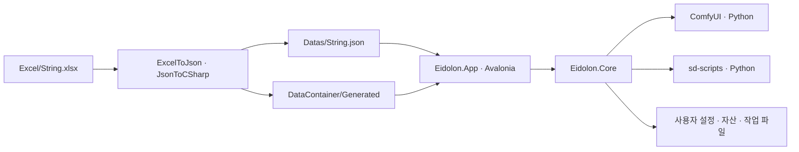

# Eidolon 아키텍처

기준일: 2026-10-03. 현재 구현의 책임 경계와 실행 흐름을 기록한다. 작업 시 지켜야 할 사항은 [작업 규칙](WorkingRules.md), 다국어 생성 절차는 [문자열 데이터 변환](StringData.md)이 소유한다.

## 제품 방향

Eidolon은 Avalonia 기반 Windows 데스크톱 이미지 생성·LoRA 학습 프로그램이다. 실행 환경과 모델을 준비한 뒤 사용자는 자연어 프롬프트를 입력하고 결과를 확인한다. 공용 긍정·부정 프롬프트는 설정에서 관리한다. 생성 파라미터와 ComfyUI 워크플로는 프로그램 내부에서 구성한다.

ComfyUI는 이미지 생성 백엔드로 사용한다. ComfyUI의 노드 편집기를 대체하거나 노드 그래프를 화면에 노출하지 않는다. 설치, 모델·LoRA 관리, 생성, 학습, 이어 학습과 학습 결과 등록을 하나의 앱에서 제공한다.

기본 모델은 SDXL Base 1.0, 기본 생성 크기는 1024×1024다. SD 1.5는 가져온 모델의 호환 계열로 지원한다. Bough의 Core/App 분리, Dignus DI, 템플릿 로딩, Excel 다국어와 라이트 테마 구성을 참고한다. 재사용 문서 중 [CodingConvention](ReusableArchitecture/CodingConvention.md)과 [ReleasePolicy](ReusableArchitecture/ReleasePolicy.md)를 적용하며 Unity·Actor·Tick·RepoDB 구조는 채택하지 않는다.

## 솔루션과 의존성

| 위치 | 책임 | 주요 타입 |
|---|---|---|
| `Eidolon.Core/Domain` | 실행 설정, 모델·작업·프리셋, 오류와 진행 계약 | `StudioSettings`, `ModelAsset`, `JobRecord`, `StudioException`, `WorkProgress` |
| `Eidolon.Core/Application` | 생성·학습 유스케이스, FIFO 큐, seed 공급 계약 | `StudioService`, `StudioWorkQueue`, `ISeedProvider` |
| `Eidolon.Core/Infrastructure` | 설치, ComfyUI 연결·실행, 학습 실행, 파일과 자산 저장 | `RuntimeInstaller`, `ComfyEngine`, `ProcessRunner`, `LoraTrainer`, `AssetLibrary`, `JobStore` |
| `Eidolon.App` | Avalonia 진입점·화면, DI 조립, 템플릿 로딩, 앱 수명 | `Program`, `App`, `MainWindow`, `TemplateDataLoader` |
| `Eidolon.App/ViewModels` | 사용자 입력, 바인딩, 화면 상태와 결과 연결 | `StudioViewModel`, 화면용 항목·선택 모델 |
| `Eidolon.App/Presenters` | 큐 진입, UI 스레드 복귀, 진행·취소와 예약 작업 수명 | `StudioWorkPresenter`, `StudioWorkState` |
| `Eidolon.App/Services`, `Localization` | 대화상자, 사용자 설정, 언어·테마, 파일 로그와 메시지 번역 | `SettingsStore`, `DesktopSettings`, `StringHelper`, `StudioMessageTemplates` |
| `DataContainer/Generated` | Excel에서 생성한 템플릿·컨테이너·로더 | `StringTemplate`, `TemplateContainer`, `TemplateLoader` |
| `Excel`, `Datas`, `ExportTools` | 문자열 원본, 생성 JSON, 변환 도구와 설정 | `String.xlsx`, `String.json` |

Core는 .NET과 Dignus.Log를 사용하며 App, Avalonia, DataContainer, 언어·테마·번역 서비스와 UI 리소스 키를 참조하지 않는다. App은 Core와 DataContainer를 참조하고 Avalonia 및 Dignus DI를 사용한다. DataContainer는 생성 데이터 계약을 제공한다.

`StudioException`은 `StudioMessageCode`와 인자를, `WorkProgress`는 코드·인자·진행률·불확정 진행 여부를 전달한다. App의 `StudioMessageTemplates`가 코드와 Excel 키의 대응을 소유하고 `StringHelper`가 표시 문장을 만든다. Core에 `IStringProvider`를 두지 않는다. 언어·테마를 포함한 전체 사용자 설정은 App의 `DesktopSettings`와 `SettingsStore`가 소유하며 Core에는 실행용 `StudioSettings`를 전달한다.

## 시작, DI와 종료

1. `Program`이 사용자별 Mutex로 앱 중복 실행을 제한하고 `DesktopLogging`과 전역 오류 로그를 구성한다.
2. Avalonia 시작 전에 `TemplateDataLoader.Load`가 생성 `TemplateLoader.Load`와 `MakeRefTemplate`을 실행한다.
3. `App`이 Dignus `ServiceContainer`에서 저장소, HTTP 클라이언트, 시간·seed 공급자, 엔진, 유스케이스, 큐, Presenter와 ViewModel을 조립한다. 주요 런타임 서비스와 큐는 앱 공용 인스턴스다.
4. DI로 생성한 `MainWindow`에 ViewModel과 문자열 서비스를 주입한다. 창이 열리면 설정·이력을 읽고 엔진 준비 작업을 예약한다.
5. 설정된 주소의 기존 ComfyUI에 먼저 연결한다. 기존 서버가 없으면 조건에 맞는 로컬 설치 엔진을 실행한다. 설치가 필요한 경우 엔진 탭으로 안내한다.
6. 창을 닫을 때 새 요청을 막고 예약·대기 요청과 현재 작업을 취소한 뒤 큐 종료를 기다린다. 이어 앱 소유 엔진을 정리하고 HTTP 클라이언트와 로그를 종료한다.

View는 DI 컨테이너, HTTP 클라이언트나 별도 작업 큐를 생성하지 않는다. `StudioWorkPresenter`는 비동기 실행과 UI 알림의 수명을 담당한다. 기능별 서비스 호출 뒤 화면 목록·결과를 갱신하는 연결은 ViewModel에 남아 있다.

## 화면 구성

상단 브랜드와 같은 줄에 이미지 생성, 모델·LoRA, 학습, 엔진, 설정, 사용법 탭을 배치한다. 엔진 설치는 엔진 탭에서 관리한다. 작업 정보는 생성·학습 결과 영역에 두며 다른 탭에 생성 안내나 작업 정보 패널을 상시 표시하지 않는다.

공통 하단에는 현재 상태 메시지, 진행률, 현재 작업 취소, 대기 건수와 목록을 표시한다. 대기 상태에는 중립적인 준비 문구를 사용한다. 상세 프로세스 출력은 파일 로그에 기록한다.

설정에서 한국어·영어와 라이트·블랙 테마를 즉시 적용하고 저장한다. 라이트 테마는 Bough의 헤더 `#A7C6DB`, 배경 `#F7FAFC`, 본문 `#1D3447`, 강조 `#285F88`을 기준으로 한다. 동작 아이콘은 공용 Avalonia 벡터 경로와 소유 버튼의 전경색을 사용한다. 앱 아이콘 원본은 `Eidolon.App/Assets/AppIcon.svg`이며 PNG·ICO를 함께 사용한다.

## 엔진 설치

사용자가 선택한 폴더 아래 `EidolonRuntime`을 설치한다. 설치 환경이 없는 사용자도 이 경로를 선택해 준비할 수 있다. 설치 소유 기록이 없는 비어 있지 않은 폴더는 덮어쓰지 않는다. 실패·취소 시 설치 상태와 로그를 보존하며 같은 경로에서 복구한다.

`RuntimeLayout`이 경로와 고정 버전의 원본이다. 현재 설정은 다음과 같다.

| 구성요소 | 고정 버전·방식 |
|---|---|
| ComfyUI | `v0.38.0`, 공식 GitHub 태그 압축 |
| sd-scripts | `v0.12.0`, 공식 GitHub 태그 압축 |
| uv | `0.12.22` |
| Python | `3.11.17`, 사용자 설치 경로의 로컬 Python |
| PyTorch / torchvision | `2.10.0` / `0.25.0` |
| GPU 패키지 | NVIDIA CUDA 12.8 |

GitHub 소스를 직접 내려받으므로 사용자에게 Git 설치를 요구하지 않는다. uv로 로컬 Python과 생성·학습용 독립 venv를 구성하고 시스템 Python, PATH와 레지스트리를 변경하지 않는다. ComfyUI와 sd-scripts 실행에는 Python이 필요하며 C#이 실행·감시를 담당한다.

기본 SDXL 모델 받기는 선택 사항이며 모델 가중치는 Hugging Face의 고정 리비전에서 내려받는다. `AssetLibrary`가 모델 파일·다운로드 URL·SHA-256의 원본을 소유한다. 모델 라이선스는 설치 폴더에 보존한다. 엔진 소스와 모델 가중치는 별도 다운로드다.

uv와 기본 모델은 SHA-256으로 확인하며 중단된 다운로드는 `.part`에서 이어받는다. 압축 해제는 경로 이탈, 링크와 해제 크기를 제한한다. 모든 전이 Python 패키지의 해시 잠금은 아직 구현하지 않았다. GPU 설치는 NVIDIA를 지원하며 CPU 모드는 이미지 생성만 지원한다. 기존 환경의 삭제나 자동 업데이트는 수행하지 않는다.

## 서버 주소와 소유권

접속 설정은 `ServerAddress` 하나이며 기본값은 `http://127.0.0.1:8189`다. 포트와 listen 주소는 URI에서 계산한다. 별도 로컬 포트 입력이나 외부 서버 모드를 현재 설정으로 저장하지 않는다.

| 주소·연결 상황 | 처리 | 연결 후 버튼 |
|---|---|---|
| 해당 주소에 ComfyUI 실행 중 | `/system_stats`로 확인 후 기존 서버에 연결 | 연결 끊기 |
| 서버가 없는 HTTP 루프백 루트 주소, 포트 1024~65535 | 설치된 로컬 Python과 `main.py`로 서버 실행 | 엔진 정지 |
| HTTPS·원격·하위 경로 주소 | 실행 중인 서버에 연결 시도 | 연결 끊기 |
| 로컬 서버와 설치 환경 모두 없음 | 엔진 설치 화면 안내 | 엔진 켜기 |

기존 서버 연결은 로컬 설치 환경 없이도 가능하다. 서버가 없는 원격 주소에 프로세스를 실행하지 않는다. 연결 전 버튼은 로컬 실행 가능한 주소의 엔진 켜기 또는 기존 서버에 대한 서버 연결이다.

주소 입력이 멈춘 뒤 600ms 후 자동 저장·연결한다. 작업 중에는 Presenter가 마지막 변경만 보관하고 FIFO 큐가 비면 적용한다. 변경을 예약하거나 적용하는 동안 새 생성·학습 요청을 막으며 이미 대기 중인 요청의 설정 사본을 유지한다.

`ComfyEngine`이 연결·준비 상태와 생성 통신을, `ProcessRunner`가 프로세스 시작·출력·종료 대기·취소를 소유한다. `EngineConnection`은 서버 주소, 프로세스 소유 여부와 로컬 자산 사용 여부를 전달한다. 소유권과 로컬 자산 사용 여부는 서로 다른 판단이다.

앱이 실행한 ComfyUI는 숨겨 실행하며 `WindowsProcessLifetime`의 Windows Job Object에 연결한다. 앱 종료·비정상 종료 시 자식 프로세스까지 정리한다. 기존 서버에 연결한 경우에는 해당 서버를 앱의 Job Object에 넣지 않고 연결 끊기·앱 종료 때 종료하지 않는다.

기존 설정의 이전 로컬 모드 `EnginePort`와 외부 모드 `UseExternalServer`는 App의 `SettingsStore`에서 주소로 이전한다. 로컬 모드의 포트는 루프백 주소로 변환하고 외부 모드의 주소는 보존한다. 이전 필드는 다음 저장에서 제거하며 다른 알 수 없는 필드는 같은 설정 객체의 `JsonExtensionData`로 보존한다. 재실행 때 주소를 반복 변환하지 않는다.

## 작업 큐

`StudioWorkQueue` 한 개가 생성·학습 요청을 FIFO 순서로 실행한다. 현재 요청이 완료·실패·취소되면 다음 요청을 실행한다. 실행 중에도 사용자는 다음 요청을 작성하고 추가할 수 있다.

요청 추가 시 프롬프트, 설정, 모델·LoRA와 학습 입력 값을 복사한다. 파일 내용은 요청 추가 시 고정하지 않으며 학습 이미지·캡션은 실제 학습 시작 시 작업 폴더로 복사한다. 설치·모델 관리·설정 저장과 연결 변경은 큐 실행과 충돌하지 않도록 Presenter의 유지 관리 경로를 통한다.

현재 작업 취소는 실행 중인 요청 하나만 취소한다. 대기 작업 비우기는 아직 시작하지 않은 요청만 제거한다. 대기열은 메모리에 보관하고 앱 종료 시 비우며 다음 실행에 복원하지 않는다. 실제 시작된 작업과 결과는 `JobStore`에 기록한다. 비정상 종료한 실행 작업은 다음 시작에서 중단 상태로 표시하며 자동 재개하지 않는다.

ComfyUI 요청은 해당 작업 ID에 대한 개별 취소를 사용한다. 기존 서버에 전역 interrupt나 전체 서버 큐 삭제를 요청하지 않는다. 개별 취소가 실패하면 안내를 표시하고, 앱 소유 서버에 한해서 서버 정리로 중단할 수 있다.

## 모델과 이미지 생성

로컬 체크포인트는 `Models/checkpoints`, LoRA는 `Models/loras`에 보관하며 `ModelPaths.yaml`로 ComfyUI에 연결한다. 관리 엔진 준비와 목록 갱신 시 실제 `.safetensors`를 읽는다. 파일이 없는 등록은 목록에서 제외하며 생성·학습 선택에는 준비된 체크포인트만 표시한다.

`SafetensorsInspector`가 텐서와 메타데이터로 SD 1.5·SDXL 계열을 판별한다. 판별할 수 없는 자산은 모델 화면에서 수동 지정한다. 계열 목록은 설치된 계열을 기본으로 표시하며 미확인 자산을 선택한 경우 수동 분류를 제공한다. 등록 해제는 라이브러리 정보를 제거하고 가중치 파일은 보존한다.

기본 모델을 지정하지 않으면 SDXL을 먼저 선택한다. 모델과 LoRA 계열은 일치해야 하며 생성 화면에는 선택 모델과 같은 계열의 LoRA를 표시한다. SD3·FLUX·inpainting·refiner 전용 모델은 현재 지원하지 않는다.

기존 서버의 실행 인자에서 현재 Runtime의 `ModelPaths.yaml`이 확인되면 로컬 자산으로 처리해 가져오기·다운로드와 파일 판별을 유지한다. 다른 서버의 자산은 `/models/checkpoints`, `/models/loras`로 읽고 API가 없으면 `/object_info`를 사용한다. 서버별 계열·트리거 정보도 `AssetLibrary`가 소유한다. 실행용 설정의 `UseServerAssets`는 연결 결과를 전달하는 임시 값이며 JSON에 저장하지 않는다.

이미지 생성 흐름은 다음과 같다.

1. 큐에 고정한 입력과 선택 모델·LoRA를 검증한다.
2. 공용 긍정 프롬프트 → 사용자 프롬프트 → LoRA 트리거 순서로 합성한다. 부정 프롬프트는 공용 설정을 사용한다.
3. `ISeedProvider`로 seed를 만들고 `JobStore`에 입력과 seed를 기록한다.
4. `GenerationPreset`과 `ComfyWorkflowBuilder`로 내부 워크플로를 구성한다.
5. ComfyUI `/prompt`로 요청하고 `/ws`, `/history`로 진행·결과를 받는다.
6. `/view`로 이미지를 작업 폴더에 저장하고 화면에 표시한다.

생성 프리셋의 원본은 `GenerationPreset`이다. 현재 SDXL은 1024 해상도·30 steps·CFG 5, SD 1.5는 512 해상도·28 steps·CFG 7을 사용한다. 공통 sampler는 `dpmpp_2m`, scheduler는 `karras`이며 기본 화면에서 사용자에게 세부값을 요구하지 않는다.

## LoRA 학습과 이어 학습

학습 입력은 로컬 기반 모델, 이미지 폴더, 이름, 트리거와 공통 설명이다. 같은 이름의 `.txt` 캡션이 있으면 사용하고 없으면 공통 설명을 사용한다. 이미지·캡션은 작업의 `Dataset`에 복사해 원본을 보존한다.

학습에는 앱이 소유한 로컬 생성 엔진, 로컬 기반 모델과 학습 환경이 필요하다. 기존 서버는 다른 사용자의 GPU 작업과 종료 권한을 보장할 수 없어 학습에 사용하지 않는다. 해당 프로그램에서 기존 서버를 종료하고 Eidolon이 시작하는 로컬 엔진으로 전환하도록 안내한다.

`StudioService`가 학습 전 앱 소유 생성 서버를 멈추고 `LoraTrainer`가 별도 학습 Python으로 sd-scripts를 실행한다. SDXL은 `sdxl_train_network.py`, SD 1.5는 해당 학습 스크립트를 사용한다. 내부 학습값은 `TrainingPreset`과 `LoraTrainer`가 소유하며 기본은 1000 steps, rank·alpha 16, AdamW, 학습률 0.0001, fp16이다.

정상 종료 후 산출물을 확인하고 완성 LoRA를 `AssetLibrary`에 등록해 이후 생성에 사용할 수 있게 한다. 학습은 성공했으나 등록이 실패하면 그 상태와 산출물 경로를 보존한다. 학습 완료·실패·취소 뒤 관리 엔진을 복구하며 앱 종료 중에는 다시 시작하지 않는다.

이어 학습은 같은 계열의 로컬 LoRA를 선택해 `--network_weights`, `--dim_from_weights`로 기존 가중치와 rank를 불러온다. optimizer와 스케줄은 새로 시작하므로 학습 체크포인트 전체 재개와 구분한다. 결과는 새 파일로 저장·등록하고 원본 LoRA를 보존한다. 작업 이력에도 기반 LoRA를 기록한다.

## 영속 데이터와 로그

| 소유자 | 위치 | 내용 |
|---|---|---|
| App `SettingsStore` | `%LOCALAPPDATA%/Eidolon/Settings.json` | 설치·CPU, 서버 주소, 언어·테마, 공용 프롬프트, 기본 모델 |
| `AssetLibrary` | 같은 사용자 폴더의 `Assets.json` | 설치 루트·서버 주소별 모델 계열, 엔진 이름, 트리거 |
| `JobStore` | 같은 사용자 폴더의 `Jobs/<ID>` | `Job.json`, 결과 이미지, 학습 데이터·산출물, 학습 인자와 로그 |
| `RuntimeInstaller` | `<선택한 폴더>/EidolonRuntime/Runtime.json` | 설치 소유자, 스키마, 상태, 버전 |
| `DesktopLogging` | `%LOCALAPPDATA%/Eidolon/Logs/Eidolon.log` | Dignus.Log 앱 로그 |
| `ProcessLogFile` | `EidolonRuntime/Logs/Install.log`, `Engine.log`, 작업 폴더의 `Training.log` | 설치·생성 엔진·학습 stdout/stderr |

각 개념의 읽기·쓰기는 해당 소유자를 통한다. ViewModel 목록은 화면 표시용이다. `AtomicJsonFile`은 임시 파일에 쓴 뒤 교체하고 이전 파일을 `.bak`으로 보존한다. 손상되거나 지원하지 않는 스키마를 기본값으로 덮어쓰지 않는다. 기존 파일에 없는 선택 필드는 기본값으로 읽으며 언어·테마 필드가 없으면 OS 언어와 블랙 테마를 사용한다.

`DesktopLogging`은 프로세스 진입부터 종료까지 Dignus.Log 타깃을 관리한다. `ProcessLogFile`은 개별 프로세스 출력 파일 타깃을 관리한다. 로그는 일별 회전하고 최대 7개를 보관한다. 현재 상태와 진행률은 App이 Core의 메시지 코드를 번역해 하단에 표시한다.

## 다국어와 템플릿

문자열 원본은 `Excel/String.xlsx`의 Data·Define 시트다. ExcelToJson → JsonToCSharp 순서로 `Datas/String.json`과 `DataContainer/Generated`를 생성한다. 자세한 명령과 산출물 계약은 [StringData](StringData.md)를 따른다.

Debug에서는 출력 폴더의 `Datas`를 먼저 읽고 배포 시 App의 내장 JSON 리소스를 읽는다. 공용 `StringHelper`가 생성 `TemplateContainer<StringTemplate>`에서 문자열을 조회하고 `LanguageService`가 화면 리소스에 반영한다. 별도 번역 사전이나 병렬 문자열 원본을 만들지 않는다. 사용자 프롬프트·캡션·모델 이름과 외부 도구의 원문은 번역하지 않는다.

## 개발과 배포 경계

개발 SDK는 .NET 10, 대상은 `net10.0`, UI는 Avalonia 12.1.3이다. 런타임 설치와 로컬 프로세스 관리는 Windows x64를 대상으로 한다.

`WindowsX64.pubxml`은 win-x64 자체 포함 단일 EXE, 네이티브 라이브러리 포함, 트리밍 비활성화, 압축과 임베디드 디버그 정보를 설정한다. 필수 UI·문자열·고지 리소스는 앱에 포함한다. 사용자 설정·작업 데이터는 사용자 폴더, Python 엔진·모델은 선택 설치 경로에 둔다. 실행 파일 게시와 업로드는 Git 커밋·푸시와 별도 작업이다.

현재 사용자 지시로 빌드·테스트·앱 실행 검증을 수행하지 않는다. 문서의 구현 설명은 실행 성공의 보고가 아니다. 검수 범위와 검증 재개 기준은 [작업 규칙](WorkingRules.md)을 따른다.
