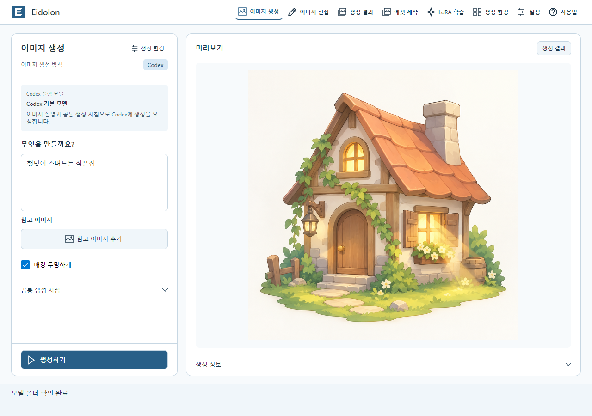
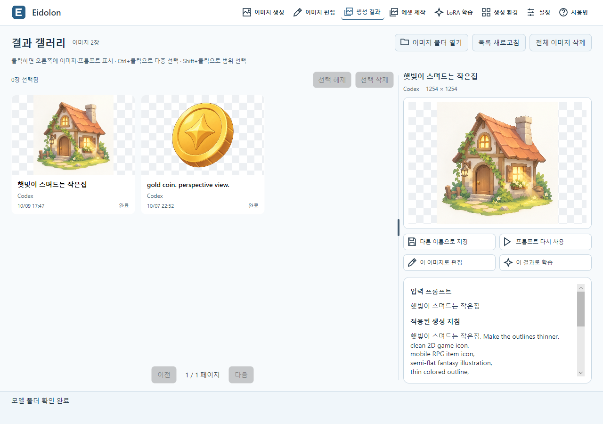
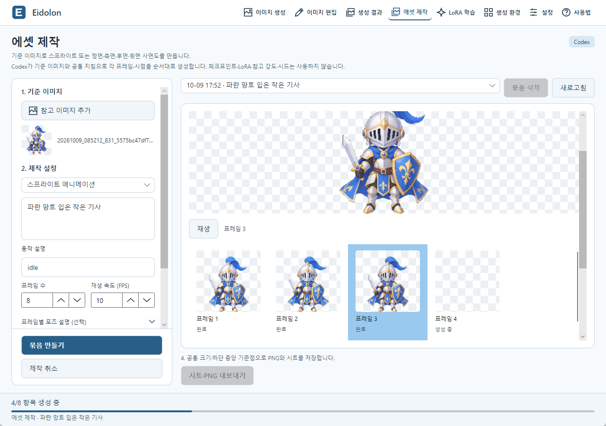
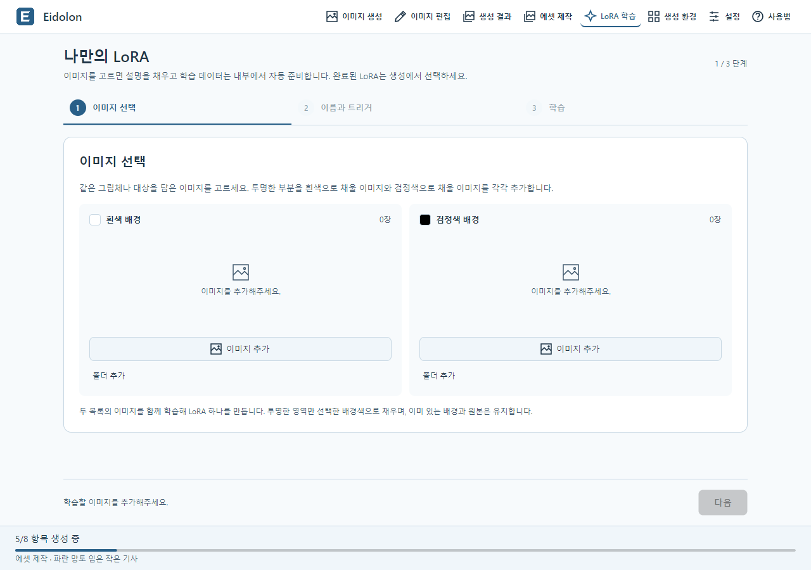

# Eidolon

[한국어](README.md) | **English**

**Eidolon is a desktop app for generating and editing images, creating game assets, and training LoRAs from prompts and reference images.**

Choose ComfyUI or your installed Codex, then work with shared generation guidelines, saved results, sprites, and four-view sheets in one app.

## Download

[Download Eidolon v0.1.0-beta.1 for Windows x64](https://github.com/EomTaeWook/Eidolon/releases/download/v0.1.0-beta.1/Eidolon-0.1.0-beta.1-win-x64.exe) · [Release notes](https://github.com/EomTaeWook/Eidolon/releases/tag/v0.1.0-beta.1)

Run the single `.exe` file. No extraction or separate .NET installation is required. For Codex, sign in to your installed Codex first. For ComfyUI, prepare the engine and models through the app.

## Screenshots

### Image generation



Describe the image and choose a reference and background options. Keep the inputs and result preview side by side while preparing your next request.

### Results



Select an image in the gallery to read its prompt and generation settings. Save the result, reuse its prompt, edit it, or use it for training.

### Asset creation



Generate sprite frames in sequence from a reference image, then compare and play the selected frames. Regenerate, replace, reorder, and export them from the same screen.

### LoRA training



Add training images to the white or black background lists. Review the images, name and trigger, then configure training. The app prepares the dataset automatically.

All screenshots show the actual Windows app using Korean and the light theme.

## Core experience

- **Prompt-based generation**: Describe your subject and optionally add a reference image.
- **Shared style guidelines**: Save guidelines, exclusions, and presets for both generation and editing.
- **Continue from a result**: Inspect generation settings, reuse a prompt, edit an image, or use it for training or asset creation.
- **Game assets**: Create sprite frames or front, side, back, and top views from a reference, then compare and export them.
- **Train with your images**: Let the app prepare a dataset and use the completed LoRA when generating.

## Features

- **Generation and editing**: ComfyUI or Codex, reference images, source-image editing, and transparent backgrounds
- **Results**: PNG gallery, saved prompts and settings, reuse, export, and selected-image deletion
- **Sprites and four views**: Playback, reordering, per-item regeneration and replacement, resume, and PNG, sheet, coordinate, and FPS JSON export
- **Models and LoRAs**: safetensors folder scanning, SD 1.5 and SDXL families, compatible LoRA selection, and automatic trigger words
- **LoRA training**: Automatic dataset preparation, new or continued training, quick settings, cancellation, and estimated time remaining
- **Jobs**: A shared queue, additional requests while running, cancellation, pending-request cleanup, and preserved originals and logs
- **Settings and connections**: Korean and English, light and black themes, output folder, external ComfyUI servers, and MCP

Sprites and four views are reference-based drafts. Review generated motion, appearance, and viewpoints for your use case. The current distribution targets Windows x64.

## Run

### Run the release

1. Save the Windows x64 executable from Releases and run it.
2. Open **Generation environment > Generation method and guidelines**, then choose ComfyUI or Codex.
3. For Codex, sign in to your installed Codex. Choose an execution model from the retrieved list; Default model uses the CLI default. Select `codex.exe` if the app cannot locate it.
4. For ComfyUI, prepare the engine in **Settings > Engine setup and connection**. Install a model in **Generation environment > Models and LoRAs**, or put `.safetensors` files in Model folder or LoRA folder and refresh.
5. Set shared guidelines and exclusions, save the generation environment, and submit a description in **Generate**.

Settings and job data are stored under `%LOCALAPPDATA%\Eidolon`. Replacing the executable for an update preserves this data.

### Images and assets

**Edit** takes a source image and edit instructions, then saves a new image. **Results** lets you reuse a prompt, edit, or train from an image. Right-click the large result image to send it to asset creation.

**Asset creation** makes sprites using an action, frame count, and FPS, or four views covering front, side, back, and top. Preview and export use the same size normalization. Deleting a collection removes its record and internal working files while preserving generated PNGs, prompt JSON, and exported files.

**LoRA training** guides you through image selection, name and trigger review, and training settings. It requires a local ComfyUI runtime, a base model, and an NVIDIA GPU. A saved LoRA trigger is applied automatically when generating. Local checkpoints, LoRAs, seeds, and change strength do not apply to Codex generation.

The app's **Help** screen provides instructions in both languages. See the [user guide](Docs/Usage.md) in Korean and the [asset creation guide](Docs/AssetCreation.md) for detailed workflows and export contracts.

### Run from source

Development requires the .NET 10 SDK. From the repository root:

```powershell
dotnet run --project Eidolon.App/Eidolon.App.csproj
```

## MCP

Enable the server in **Settings > General > MCP connection** and register `http://127.0.0.1:8190/mcp` with your client. Generation, editing, results, and asset creation use the same job queue as the UI. Per-request guidelines leave saved settings unchanged. See [MCP usage](Docs/Mcp.md) for examples and connection details.

## Technology

- **Language and runtime**: C# / .NET 10
- **Distribution**: Windows x64
- **UI**: Avalonia
- **Generation**: ComfyUI or installed Codex

See [Architecture](Docs/EidolonArchitecture.md), [Docs](Docs/README.md), and [Working rules](Docs/WorkingRules.md) for implementation and development details.

## Data and publishing

The source of localized text is `Excel/String.xlsx`. ExcelToJson and JsonToCSharp generate runtime data and C# templates. Debug reads output-folder JSON first; Release uses the JSON embedded in the executable. Follow [String data generation](Docs/StringData.md).

Publish the self-contained Windows x64 executable with:

```powershell
dotnet publish Eidolon.App/Eidolon.App.csproj -p:PublishProfile=WindowsX64 -o artifacts\win-x64 -m:1 /p:UseSharedCompilation=false
```

The executable includes the runtime, UI libraries, localized resources, and notices. Generation engines and weights are installed separately in your selected directory. The beta was packaged for publication; separate automated tests and execution checks of the release executable were not performed.

## License

Eidolon is source-available software under the [Eidolon Source License 1.0](LICENSE).

- Free use is permitted for personal, educational, internal business, and commercial game and asset production.
- Modification and free redistribution are permitted when license and copyright notices are preserved, material changes are identified, and recipients receive the same terms.
- Selling or charging for Eidolon, including modified, repackaged, or renamed apps based substantially on it, requires separate written permission from the copyright holder.
- The app's resale restriction does not apply to user outputs such as generated images, sprites, sheets, or trained LoRAs. Model licenses, service terms, input permissions, and third-party rights still apply.

Users are responsible for checking rights to inputs and outputs, their use, sale and distribution, and compliance with applicable laws and terms. The developer does not warrant the legality, ownership, or non-infringement of outputs and limits liability to the extent permitted by law. Liability that cannot lawfully be excluded remains unaffected. See [LICENSE](LICENSE) for the governing terms.

## Third-party components

Eidolon uses Avalonia for its UI, ComfyUI for local generation, and sd-scripts for training. Models and additional weights retain their distributors' terms. See [Third-party notices](Docs/ThirdPartyNotices.md) for licenses, versions, and notices delivered during installation.
